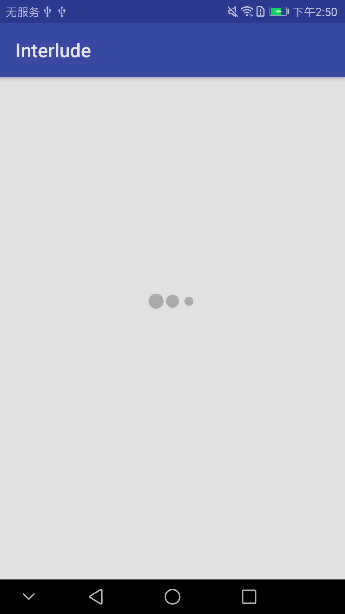
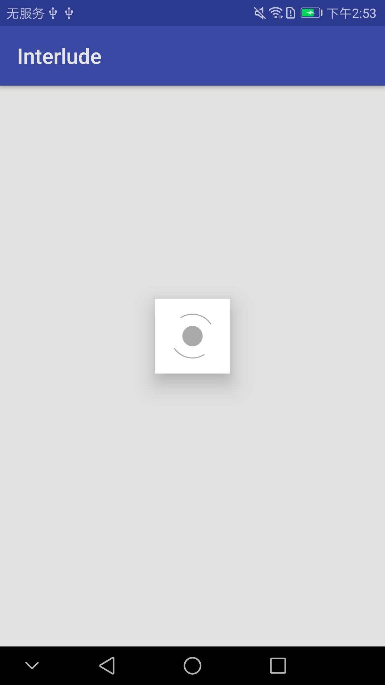

# Interlude

提供Loading动画的DialogFragment.主要目的是用于替代ProgressDialog<br>
动画由[AVLoadingIndicatorView](https://github.com/81813780/AVLoadingIndicatorView)实现


 

## 使用方法

`    compile 'com.twisty.interlude:1.0.0'
`
```
//construct
var interlude: Interlude = Interlude(supportFragmentManager)

//config
with(interlude) {
           dim = 0.1F                                            //dialog弹出时背景变暗程度
           indicatorColorResource = android.R.color.darker_gray  //progress的颜色
           backGroundColorResource = android.R.color.transparent //dialog的背景色
           indicatorType = IndicatorType.BallPulseIndicator      //progress的类型
           isCancelable = true                                   //是否可以取消
           canceledOnTouchOutside = false                        //点击界外是否取消
           cancelCallback = {
               Log.i(localClassName, "Cancel")
           }                                                     //取消回调
           dismissCallback = {
               Log.i(localClassName, "Dismiss")
           }                                                     //消失回调,cancel也会执行dismiss
       }

//show
interlude.show()


//dismiss
interlude.dismiss()

```


`IndicatorType` 对应[AVLoadingIndicatorView](https://github.com/81813780/AVLoadingIndicatorView)的各个`Indicator`


```
enum class IndicatorType {
            BallPulseIndicator,
            BallGridPulseIndicator,
            BallClipRotateIndicator,
            BallClipRotatePulseIndicator,
            SquareSpinIndicator,
            BallClipRotateMultipleIndicator,
            BallPulseRiseIndicator,
            BallRotateIndicator,
            CubeTransitionIndicator,
            BallZigZagIndicator,
            BallZigZagDeflectIndicator,
            BallTrianglePathIndicator,
            BallScaleIndicator,
            LineScaleIndicator,
            LineScalePartyIndicator,
            BallScaleMultipleIndicator,
            BallPulseSyncIndicator,
            BallBeatIndicator,
            LineScalePulseOutIndicator,
            LineScalePulseOutRapidIndicator,
            BallScaleRippleIndicator,
            BallScaleRippleMultipleIndicator,
            BallSpinFadeLoaderIndicator,
            LineSpinFadeLoaderIndicator,
            TriangleSkewSpinIndicator,
            PacmanIndicator,
            BallGridBeatIndicator,
            SemiCircleSpinIndicator,
}
```
